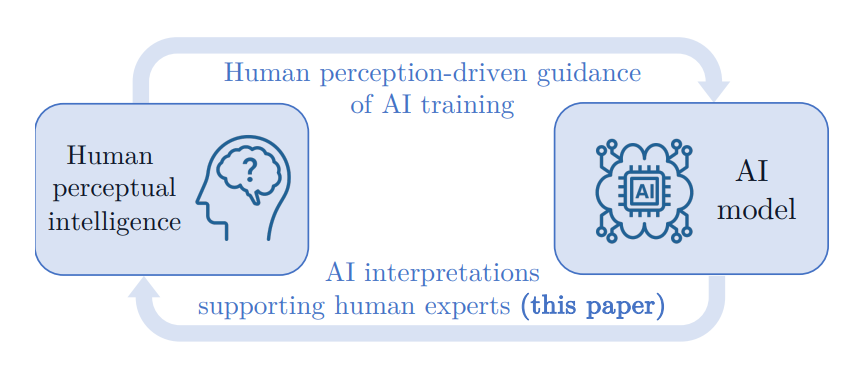
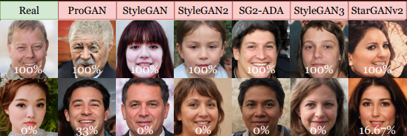
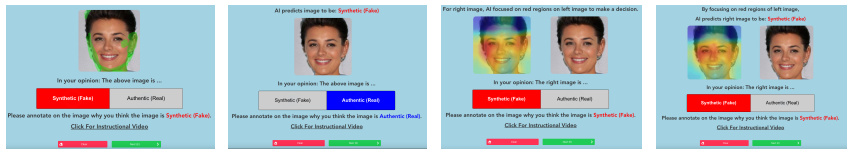
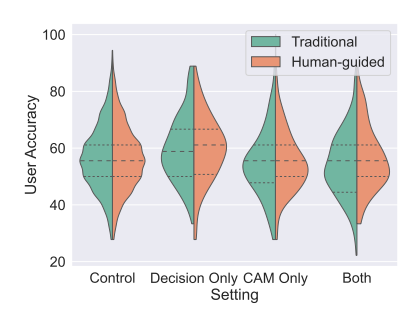
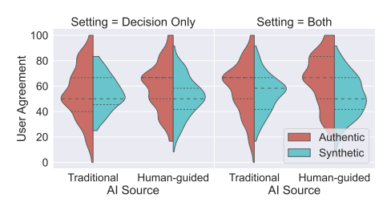

# The Value of AI Guidance in Human Examination of Synthetically-Generated Faces

Aidan Boyd, Patrick Tinsley, Kevin Bowyer, Adam Czajka  
University of Notre Dame, Notre Dame IN 46556, USA  
{aboyd3,ptinsley,kwb,aczajka}@nd.edu  
<a href="https://arxiv.org/pdf/2208.10544.pdf">Official Paper</a>    

## Abstract

Face image synthesis has progressed beyond the point at which humans can effectively distinguish authentic faces from synthetically generated ones. Recently developed synthetic face image detectors boast “better-than-human” discriminative ability, especially those guided by human perceptual intelligence during the model’s training process. In this paper, we investigate whether these human-guided synthetic face detectors can assist non-expert human operators in the task of synthetic image detection when compared to models trained without human-guidance. We conducted a large-scale experiment with more than 1,560 subjects classifying whether an image shows an authentic or syntheticallygenerated face, and annotating regions supporting their decisions. In total, 56,015 annotations across 3,780 unique face images were collected. All subjects first examined samples without any AI support, followed by samples given (a) the AI’s decision (“synthetic” or “authentic”), (b) class activation maps illustrating where the model deems salient for its decision, or (c) both the AI’s decision and AI’s saliency map. Synthetic faces were generated with six modern Generative Adversarial Networks. Interesting observations from this experiment include: (1) models trained with human-guidance offer better support to human examination of face images when compared to models trained traditionally using cross-entropy loss, (2) binary decisions presented to humans results in their better performance than when saliency maps are presented, (3) understanding the AI’s accuracy helps humans to increase trust in a given model and thus increase their overall accuracy. This work demonstrates that although humans supported by machines achieve better-than-random accuracy of synthetic face detection, the approaches of supplying humans with AI support and of building trust are key factors determining high effectiveness of the human-AI tandem.

## Data Used

  

In the figure above are examples from each data source. On the top row is one sample from each of the seven image sources (one authentic plus six synthetic) that was the easiest for human subjects to correctly classify in the control portion of the collection. One the bottom row is the most difficult samples to correctly classify by human subjects. The percentages shown correspond to the average human accuracy on that image. Each of these images were classified by six independent subjects. 

## Obtaining the Data

  
A copy of the dataset offered by the authors with the paper can be requested at <a href="https://cvrl.nd.edu/projects/data/#und-aaai-2023">the CVRL webpage</a>. The name of the collection used for this work is "UND AAAI 2023".

## Method Used

 

Above is the online tool used in the experiments and three types of AI support offered to humans; they are, from left to right: no AI support (with example annotations), only AI’s classification (authentic/synthetic) of the face image displayed, only AI’s saliency (CAM) overlayed on the examined face image, and both the AI’s saliency and decision showed to humans.

## Results Summary

  
  &nbsp;&nbsp;&nbsp;&nbsp;&nbsp;&nbsp;&nbsp;
  

The left figure above presents distributions of human accuracy for all four settings (no AI support, AI decision only, AI salience regions, both AI decision and salience regions). The first, surprising observation, is that presenting the AI salience, either alone or accompanied by the AI decision, didn’t help humans achieve higher accuracy (mean accuracy hovers around 56%). Even more surprising is that this is true for both AI trained in a human-guided manner, and trained traditionally without human supervision. There is, however, a slight increase in accuracy when humans can benefit from the AI’s decision (only), displayed for each image (59%, compared to 56% for all other scenarios). This accuracy further increases to 61% when human-guided model is paired with humans. This increase is reasonable as the human-guided model is more accurate.

The agreement metric can be interpreted as humans trusting the model’s decision. Agreement of users for both traditionally trained and human-guided models can be seen in the right figure for “Decision Only” and “Both” settings (the model’s classification decision was not presented in the CAM Only setting). 100% means humans use the AI decision every time, and 0% means they always chose the opposite of the AI. Agreement with AI is generally higher when both the model’s CAM and decision are supplied to humans. Interestingly, referring back to the left figure, human accuracy is higher when only the AI decision is displayed compared to when decision and CAM are displayed. It appears that the knowledge of what the AI thinks and why leads people to be more confident in the AI decision, leading to poorer overall classification (due to AI’s relatively low accuracy). Secondly, when comparing the agreement between humans and the two AI sources, human-guided models result in higher agreement than traditionally-trained models (60% vs 50%). Both human accuracy (as in the left figure) and agreement is higher for human-guided models, meaning humans recognize the increase in AI quality and trust the decisions more. For all models in all settings in the right figure, humans have higher agreement with AI for authentic faces versus when AI predicts synthetic. This reflects the difficulty of the task of synthetic face detection

## Conclusions

The ability of humans to detect whether a face image is authentic or synthetic is essential in varied social media and forensic scenarios. The latest GAN-created synthetic face images make this task extremely difficult for humans, and the best algorithmic approaches fare only slightly better. This paper explores how human performance on this task might be improved given access to hints from a betterperforming algorithmic approach.

We found that humans correctly classify authentic face images almost two thirds of the time. Correctly classifying synthetic images is more difficult, where human accuracy is near random, at about 52%. There is no clear indication that human accuracy is associated with either the amount of time spent considering an image or the amount of the image that is annotated as salient to the decision.

One main result is that human accuracy is improved when they are shown the algorithm’s classification result. However, showing the model’s saliency, either alone without the algorithm’s classification result, or in addition to the algorithm’s classification result, is not as helpful.

We found huge differences in the quality of GAN-produced face images in the context of this task. At one end, ProGAN and StarGANv2 images are relatively easily detected as synthetic, at 94% and 90% accuracy, respectively. At the other end, StyleGAN2 and StyleGAN2-ADA images were correctly detected as synthetic only 25% and 26% of the time, respectively. The curious element of this result is that the best GANs produce images more convincing as authentic than actual authentic images.

We demonstrate that humans implicitly recognize when the underlying AI performance changes, adjusting their trust in these models accordingly. Additionally, giving explicit information about the performance of the AI improves human performance and trust in the models. This paper provides an insight into how synthetic image detection technology would be adopted by humans upon deployment.

